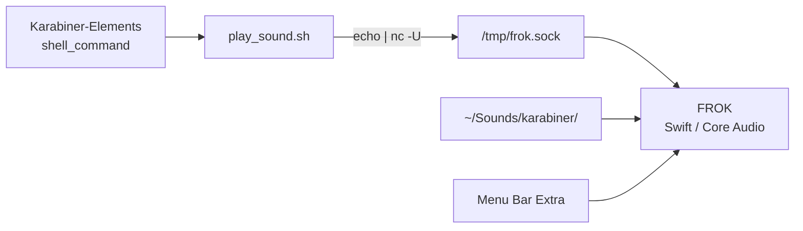

# FROK

Нативное macOS-приложение для **мгновенного воспроизведения звуков по горячим клавишам**. Заменяет резидентный Node.js-демон ([Karabiner Audio Daemon](old_daemon/AUDIO_DAEMON_SPEC.md)): держит звуки в памяти и принимает команды через Unix-сокет — без запуска `afplay` / `ffmpeg` на каждое нажатие.



## Зачем

| Было (Node.js) | Стало (FROK) |
|----------------|--------------|
| `node audio_daemon.js` + npm (`speaker`, ffmpeg) | Нативный Swift, Core Audio |
| Сокет `/tmp/keyclick.sock` | Сокет `/tmp/frok.sock` |
| LaunchAgent `com.user.keyclick` | Menu bar app (`LSUIElement`) |
| Логи в `/tmp/keyclick.log` | OSLog (`com.user.frok`) |

Протокол IPC сохранён — достаточно обновить путь к сокету в клиентском скрипте.

## Требования

- macOS 14.0+
- Xcode 15+
- Каталог звуков: `~/Sounds/karabiner/` (aliases, symlinks, обычные файлы)

## Сборка и запуск

1. Открыть `FROK.xcodeproj` в Xcode.
2. Выбрать схему **FROK**, собрать и запустить (⌘R).
3. В строке меню появится иконка динамика — приложение работает в фоне без иконки в Dock.

```bash
xcodebuild -scheme FROK -configuration Debug build
open DerivedData/Build/Products/Debug/FROK.app
```

## Протокол IPC

Клиент отправляет **одну текстовую строку** в Unix domain socket `/tmp/frok.sock` (права `0666`):

| Команда | Поведение |
|---------|-----------|
| *(пустая строка)* или `play` | Воспроизвести звук по умолчанию |
| `-stop` | Остановить все активные воспроизведения |
| `<имя_файла>` | Воспроизвести звук по имени (basename в каталоге) |

Примеры:

```bash
echo "bonk" | nc -U /tmp/frok.sock
echo "-stop" | nc -U /tmp/frok.sock
echo "" | nc -U /tmp/frok.sock   # default sound
```

Клиент для Karabiner — [`old_daemon/play_sound.sh`](old_daemon/play_sound.sh):

```bash
$HOME/.config/karabiner/play_sound.sh bonk
$HOME/.config/karabiner/play_sound.sh -stop
```

## Интеграция с Karabiner-Elements

Karabiner вызывает shell-команды из правил:

```json
{ "shell_command": "$HOME/.config/karabiner/play_sound.sh bonk" }
```

**Паттерны:**

1. **One-shot** — одно нажатие → один звук.
2. **Hold-to-play** — `to` запускает звук, `to_after_key_up` шлёт `-stop` (для длинных клипов).

Подробнее о звуках, hotkey-ах и известных несоответствиях — в [спецификации старого демона](old_daemon/AUDIO_DAEMON_SPEC.md).

## Архитектура

```
FROK/
├── FROKApp.swift              # @main, MenuBarExtra
├── AppDelegate.swift          # lifecycle, запуск/остановка сокета
├── Models/
│   └── SoundCommand.swift     # парсинг текстового протокола
├── Services/
│   ├── SocketServer.swift     # Unix socket (AF_UNIX, non-blocking accept)
│   ├── SoundCommandHandler.swift  # обработка команд
│   └── Logger+FROK.swift      # OSLog subsystem
└── Views/
    └── SettingsView.swift     # окно настроек (placeholder)
```

Поток данных:

1. `AppDelegate` при старте поднимает `SocketServer` на `/tmp/frok.sock`.
2. Клиент пишет строку → сервер парсит её в `SoundCommand`.
3. `SoundCommandHandler` выполняет команду (воспроизведение / stop).

## Текущий статус

| Компонент | Статус |
|-----------|--------|
| Menu bar app (без Dock-иконки) | ✅ |
| Unix socket server | ✅ |
| Парсинг протокола (`play` / `-stop` / имя) | ✅ |
| Preload звуков из `~/Sounds/karabiner/` | ⬜ |
| Воспроизведение через AVAudioEngine | ⬜ |
| Concurrent play + global stop | ⬜ |
| Разрешение macOS aliases | ⬜ |
| FSEvents hot-reload каталога | ⬜ |
| UI настроек (preview, список звуков) | ⬜ |
| SMAppService / автозапуск при логине | ⬜ |

## Roadmap

- [ ] Preload `~/Sounds/karabiner` в `AVAudioPCMBuffer`, воспроизведение через `AVAudioEngine`
- [ ] Concurrent playback + global `-stop`
- [ ] Разрешение macOS aliases; mapping `enter_sniper_rifle_fire.mp3` → `sniper_rifle_fire`
- [ ] FSEvents hot-reload без restart
- [ ] Menu bar UI: статус, preview, список звуков
- [ ] SMAppService для автозапуска

Полный список must-have / nice-to-have — в разделе «Что важно сохранить» [AUDIO_DAEMON_SPEC.md](old_daemon/AUDIO_DAEMON_SPEC.md).

## Отладка

Логи приложения доступны через **Console.app** — фильтр по subsystem `com.user.frok`.

Проверка, что сокет слушает:

```bash
ls -la /tmp/frok.sock
echo "test" | nc -U /tmp/frok.sock
```

## Миграция со старого демона

1. Остановить Node.js-демон: `./old_daemon/audio_daemon_control.sh stop`
2. Обновить `SOCKET_PATH` в `play_sound.sh` на `/tmp/frok.sock` (уже сделано в репозитории).
3. Запустить FROK.
4. Karabiner-правила менять не нужно — только путь к скрипту.

## Лицензия

Не указана.
