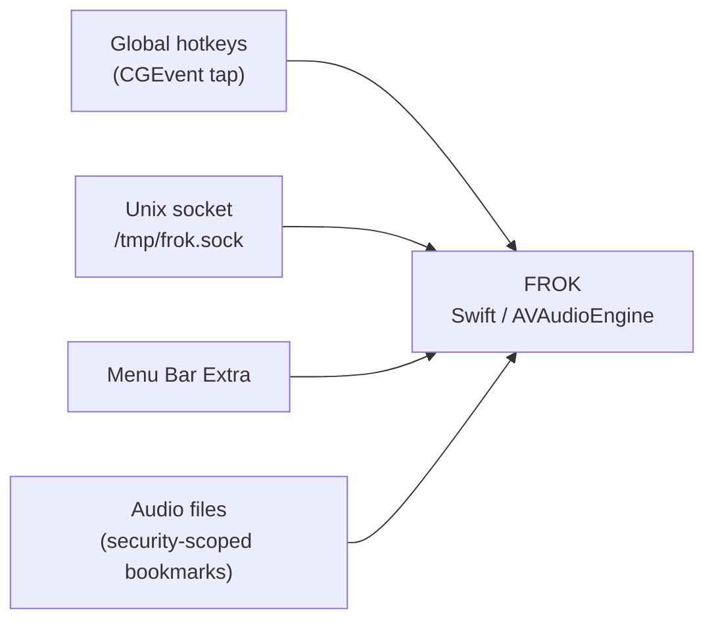

# FROK

Нативное macOS-приложение для **мгновенного воспроизведения звуков по горячим клавишам**. Держит звуки декодированными в памяти и воспроизводит их через Core Audio — без запуска `afplay` / `ffmpeg` на каждое нажатие.



## Возможности

- **Menu bar app** — работает в фоне без иконки в Dock (`LSUIElement`)
- **Глобальные hotkey-и** — назначение сочетаний клавиш на каждый звук (нужен Accessibility)
- **Hold-to-play** — удержание клавиши играет звук, отпускание останавливает
- **Preload в RAM** — файлы декодируются в `AVAudioPCMBuffer` при добавлении
- **Concurrent playback** — несколько звуков одновременно; команда `-stop` останавливает все
- **Per-sound volume** — громкость 0–150% для каждого звука
- **Unix socket IPC** — совместимый текстовый протокол для внешних скриптов и автоматизаций
- **Launch at login** — автозапуск через `SMAppService`
- **OSLog** — логи в Console.app, subsystem `com.user.frok`

## Требования

- macOS 14.0+
- Xcode 15+
- Разрешение **Accessibility** — для глобальных hotkey-ов (запрашивается из UI)

## Сборка и запуск

1. Открыть `FROK.xcodeproj` в Xcode.
2. Выбрать схему **FROK**, собрать и запустить (⌘R).
3. В строке меню появится иконка — клик открывает окно настроек.

```bash
xcodebuild -scheme FROK -configuration Debug build
open DerivedData/Build/Products/Debug/FROK.app
```

## Использование

1. Запустить FROK — при первом запуске включится **Launch at login**.
2. Нажать **Add new sound** и выбрать аудиофайлы (MP3, AIFF, WAV и др.).
3. Задать **alias** — имя для IPC-команд (например `bonk`).
4. Назначить **hotkey** — клик по полю и нажать сочетание с модификатором (⌥, ⌘, ⌃, ⇧).
5. При необходимости выдать **Accessibility** в System Settings — иначе hotkey-и не сработают.

Звуки сохраняются как security-scoped bookmarks в `UserDefaults` и переживают перезапуск приложения.

## Протокол IPC

Сокет: **`/tmp/frok.sock`** (Unix domain socket, права `0666`).  
FROK создаёт его при запуске и удаляет при выходе.

### Формат сообщения

Клиент подключается, отправляет **одну текстовую строку** (UTF-8) и закрывает соединение. Ответа от сервера нет.

| Команда | Поведение |
|---------|-----------|
| *(пустая строка)* или `play` | Воспроизвести первый загруженный звук |
| `-stop` | Остановить все активные воспроизведения |
| `<alias>` | Воспроизвести звук по alias; если не найден — fallback на первый загруженный |

`<alias>` — значение из колонки **Alias** в настройках FROK (регистр важен).

### Как отправить команду

**1. Через CLI `frok` (рекомендуется):**

CLI встроен в app bundle: `FROK.app/Contents/Resources/bin/frok`.  
При установке через Homebrew cask симлинк `frok` попадает в `PATH`.

```bash
# воспроизвести звук по alias
frok success
frok "record scratch"
frok record scratch

# остановить всё
frok stop
```

**2. Отправить строку через `nc`:**

```bash
# воспроизвести звук по alias
echo "bonk" | nc -U /tmp/frok.sock

# остановить всё
echo "-stop" | nc -U /tmp/frok.sock

# дефолтный звук (пустая команда)
echo "" | nc -U /tmp/frok.sock
echo "play" | nc -U /tmp/frok.sock
```

Для Homebrew cask:

```ruby
binary "#{appdir}/FROK.app/Contents/Resources/bin/frok"
```

## Архитектура

```
FROK/
├── FROKApp.swift                    # @main, MenuBarExtra
├── AppDelegate.swift                # lifecycle, socket + hotkeys
├── Models/
│   ├── SoundCommand.swift           # парсинг текстового протокола
│   ├── SoundEntry.swift             # звук: alias, bookmark, volume, hotkey
│   ├── SoundHotkey.swift            # модель и отображение hotkey
│   ├── SoundLoadStatus.swift
│   └── SoundPlaybackState.swift
├── Services/
│   ├── SoundLibrary.swift           # preload, AVAudioEngine, playback
│   ├── SoundCommandHandler.swift    # обработка IPC-команд
│   ├── SocketServer.swift           # Unix socket (AF_UNIX)
│   └── Shared/
│       └── FROKSocketPath.swift     # путь к сокету (shared с CLI)
├── FROKCLI/
│   ├── main.swift                   # frok CLI entry point
│   └── SocketClient.swift           # Unix socket client
│   ├── GlobalHotkeyManager.swift    # CGEvent tap, hold-to-play
│   ├── SoundPersistence.swift       # UserDefaults + bookmarks
│   ├── LaunchAtLoginManager.swift   # SMAppService
│   ├── AccessibilityPermissionManager.swift
│   ├── SoundFilePicker.swift
│   ├── MenuBarState.swift
│   └── Logger+FROK.swift
└── Views/
    ├── SettingsView.swift           # список звуков, footer
    ├── SoundRowView.swift           # строка: play, alias, hotkey, volume
    └── HotkeyRecorderField.swift
```

Поток данных:

1. `AppDelegate` поднимает `SocketServer` на `/tmp/frok.sock` и `GlobalHotkeyManager`.
2. IPC-клиент или hotkey → `SoundCommandHandler` / `SoundLibrary`.
3. `SoundLibrary` воспроизводит preloaded buffer через `AVAudioEngine` + `AVAudioPlayerNode`.

## Текущий статус

| Компонент | Статус |
|-----------|--------|
| Menu bar app (без Dock-иконки) | ✅ |
| Unix socket server | ✅ |
| Парсинг протокола (`play` / `-stop` / alias) | ✅ |
| Preload звуков в `AVAudioPCMBuffer` | ✅ |
| Воспроизведение через `AVAudioEngine` | ✅ |
| Concurrent play + global stop | ✅ |
| Глобальные hotkey-и (hold-to-play) | ✅ |
| Per-sound volume | ✅ |
| UI настроек (preview, список, hotkey recorder) | ✅ |
| SMAppService / launch at login | ✅ |
| FSEvents hot-reload файлов на диске | ⬜ |
| Более строгие права на socket (0600) | ⬜ |

## Roadmap

- [ ] Mute всех звуков
- [ ] Кроп, настройка длительности
- [ ] Удаление щелчков (смягчить старт и стоп)
- [ ] Выбор звука на нажатие любой клавиши

## Отладка

Логи — **Console.app**, фильтр по subsystem `com.user.frok`.

После отправки команды в сокет в логах появится строка вида `Received: play(name: "bonk")`.

## Лицензия

Не указана.
