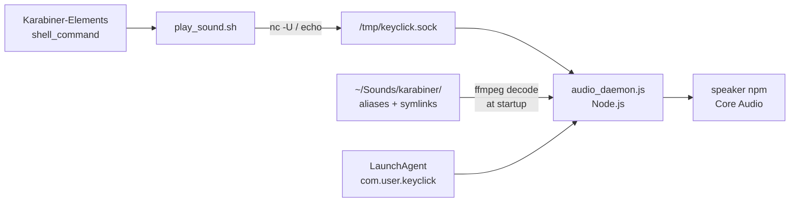
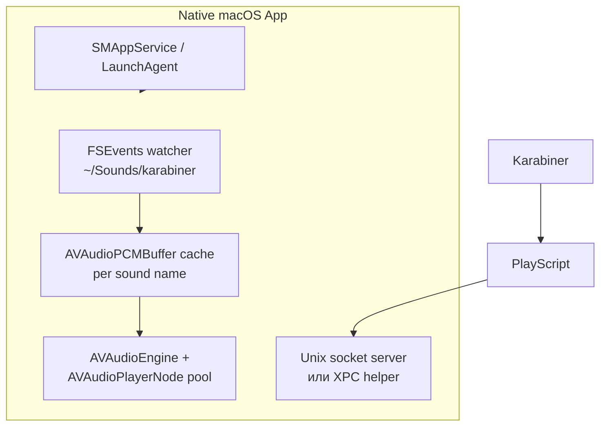

# Спецификация Karabiner Audio Daemon

Документ описывает текущую архитектуру Karabiner Audio Daemon — резидентного Node.js-сервиса с Unix-сокетом для мгновенного воспроизведения звуков по горячим клавишам. Полезен как спецификация для нативного macOS-приложения с сохранением совместимости.

## Назначение

Система решает одну задачу: **воспроизводить короткие звуки с минимальной задержкой** при нажатии клавиш в Karabiner-Elements. Вместо запуска `afplay` / `ffmpeg` на каждое нажатие работает **резидентный демон**, который держит звуки декодированными в RAM и выводит PCM напрямую в Core Audio.



---

## Компоненты

| Файл | Роль |
|------|------|
| `audio_daemon.js` | Основной демон: загрузка звуков, Unix-сокет, воспроизведение |
| `play_sound.sh` | Тонкий клиент для Karabiner: отправляет команду в сокет |
| `audio_daemon_control.sh` | start / stop / restart / status через `launchctl` |
| `install_audio_daemon.sh` | Установка LaunchAgent, `npm install`, автозапуск |
| `com.user.keyclick.plist` | LaunchAgent: `KeepAlive`, `RunAtLoad`, логи в `/tmp/keyclick.log` |
| `package.json` | Зависимости: `speaker`, `node-wav`, `@ffmpeg-installer/ffmpeg` |

**Зависимости среды:** Node.js (≥12), npm-пакеты, ffmpeg (bundled или системный).

---

## Жизненный цикл демона

1. **Установка:** `install_audio_daemon.sh` прописывает путь к `node` в plist, копирует plist в `~/Library/LaunchAgents/`, ставит npm-зависимости, делает `launchctl load`.
2. **Старт:** при логине LaunchAgent запускает `node audio_daemon.js`.
3. **Инициализация:**
   - Сканирует `~/Sounds/karabiner/` (все файлы, кроме скрытых `.`).
   - Разрешает macOS **aliases** через `osascript` + Finder, symlinks через `fs.realpathSync`.
   - Декодирует каждый файл через **ffmpeg** в PCM: **16-bit signed LE, 44100 Hz, mono**.
   - Кладёт в `Map<имя_файла, {buffer, sampleRate, channels, bitDepth}>`.
4. **Сервер:** слушает Unix domain socket `/tmp/keyclick.sock`, права `0666` (доступен любому локальному процессу).
5. **Завершение:** SIGTERM/SIGINT → закрытие сервера, удаление socket-файла.

**Важно:** горячая перезагрузка звуков **не поддерживается** — после добавления файла нужен restart демона.

---

## Протокол IPC (Unix socket)

Клиент отправляет **одну текстовую строку** (без протокола длины/JSON):

| Команда | Поведение |
|---------|-----------|
| *(пустая строка)* или `play` | Воспроизвести `enter_sniper_rifle_fire.mp3` (DEFAULT_SOUND) |
| `-stop` | Остановить **все** активные воспроизведения |
| `<имя_файла>` | Воспроизвести звук по ключу в Map (имя = basename файла в каталоге, **с расширением если оно есть**) |

**Клиент `play_sound.sh`:**
- Если сокет существует: `echo "$COMMAND" | nc -U /tmp/keyclick.sock`
- Fallback: однострочный Node.js-клиент
- **Нет fallback-а**, если демон не запущен — команда молча не выполняется (скрипт просто завершается)

---

## Модель воспроизведения

- Каждый `play` создаёт **новый** экземпляр `Speaker` + Readable stream из preloaded PCM buffer.
- **Параллельное воспроизведение разрешено** — несколько звуков могут играть одновременно (`activePlaybacks: Set`).
- `-stop` уничтожает все активные Speaker/stream (unpipe, destroy, close).
- Нет управления громкостью, панорамой, fade, loop.
- Если звук не найден — fallback на `DEFAULT_SOUND`; если и он не загружен — ошибка в лог, без звука.

**Мёртвый код:** функция `loadWavFile()` объявлена, но не используется — все форматы идут через ffmpeg. `fluent-ffmpeg` в `package.json` не используется в коде.

---

## Каталог звуков

**Путь:** `~/Sounds/karabiner/`

Файлы — в основном **macOS Finder aliases** (~900 байт), указывающие на реальные аудиофайлы (MP3, AIFF и т.д.). Демон разрешает alias при загрузке.

**Ключ в Map = имя файла в каталоге** (например `bonk`, `jet-set-radio`, без расширения — потому что aliases без расширения).

### Звуки, используемые в Karabiner (21 уникальных + stop)

Из `rules/sound.json`, `rules/caps_layer.json`, `karabiner.json`:

- **One-shot** (нажатие → звук): `bonk`, `rizz`, `quack`, `metal_gear_solid_alert`, `jet-set-radio`, `ba_dum_tsss`, `record-scratch`, `minecraft_hurt`, `boing`, `whisle_ha`, `yametekudasai_1`, `yametekudasai_2`, `frog`, `nice`
- **Hold-to-play** (нажатие → start, отпускание → `-stop`): `wow_anime`, `crickets`, `demotivator`, `wah_wah_wah`, `sax`, `turn_the_lights_off`
- **Enter-звук** (caps layer): `enter_sniper_rifle_fire.mp3` — **файла нет в каталоге** (есть `sniper_rifle_fire`)
- **Brightness down alone** → `bonk`

### Звуки в каталоге, но не привязанные к Karabiner

`applepay`, `click`, `drop`, `glass`, `jump-8bit`, `maximize`, `minimize`, `minecraft_villager`, `music_end_pau`, `power-up`, `power-up-2`, `sniper_rifle_fire`, `sound_of_failure`, `sound_of_success`, `strings_funny` — демон загружает их в память, но hotkey-ов нет.

### Известные несоответствия

- `enter_sniper_rifle_fire.mp3` и `nice` — вызываются из Karabiner, **отсутствуют** в `~/Sounds/karabiner/`
- В `sound.json` **два правила на клавишу `w`** (right_option): `wow_anime` и `wah_wah_wah` — конфликт, сработает только одно

---

## Паттерны интеграции с Karabiner

Karabiner вызывает только:

```bash
$HOME/.config/karabiner/play_sound.sh <sound_name>
$HOME/.config/karabiner/play_sound.sh -stop
```

**Два UX-паттерна:**

1. **Мгновенный звук** — `to: [{ shell_command: "... play_sound.sh bonk" }]`
2. **Удержание клавиши** — `to` запускает звук, `to_after_key_up` шлёт `-stop` (для длинных/loop-подобных клипов)

Горячие клавиши сгруппированы в rule-set **"Key sounds"** (`right_option + буква`), плюс отдельные правила для Enter в caps layer и brightness key.

---

## Операционные аспекты

- **Логи:** stdout → `/tmp/keyclick.log`, stderr → `/dev/null` (ошибки ffmpeg/speaker теряются)
- **Управление:** `./audio_daemon_control.sh {start|stop|restart|status}`
- **Память:** все звуки декодированы в RAM при старте; для ~35 коротких клипов это приемлемо
- **Безопасность:** socket с `chmod 666` — любой локальный процесс может воспроизвести/остановить звук
- **Качество:** принудительный downmix в mono 44100 Hz

---

## Что важно сохранить в нативном macOS-приложении

### Must-have (функциональный паритет)

1. **Резидентный фоновый процесс** с автозапуском (SMAppService / LaunchAgent)
2. **Preload + low-latency playback** — без spawn процесса на каждое нажатие
3. **Unix socket `/tmp/keyclick.sock`** с тем же текстовым протоколом — drop-in совместимость с существующим `play_sound.sh` и всеми Karabiner-правилами
4. **Команды:** имя звука, `-stop`, default sound
5. **Поддержка macOS aliases** в `~/Sounds/karabiner/` (или миграция на plain symlinks / копии)
6. **Concurrent playback + global stop**
7. **Hold-to-play** семантика остаётся на стороне Karabiner (клиенту достаточно play/stop)

### Nice-to-have (улучшения над текущей системой)

- Hot-reload каталога звуков (FSEvents / `DispatchSource`)
- Fallback при недоступном демоне (одиночный `afplay` или очередь с автозапуском)
- Алиасы имён (`enter_sniper_rifle_fire.mp3` → `sniper_rifle_fire`)
- UI: список звуков, preview, назначение hotkey-ов (если уходить от Karabiner)
- Нормальное логирование (OSLog / файл с rotation)
- Настройка громкости per-sound
- Безопаснее socket (0600 + ACL или XPC вместо world-writable)
- Стерео без принудительного mono downmix
- Menu bar icon + status (running / sounds loaded)

### Рекомендуемый нативный стек



- **AVAudioEngine + AVAudioPlayerNode** — аналог `speaker`, нативный Core Audio, низкая задержка
- **AVAudioFile / ExtAudioFile** — декодирование вместо ffmpeg (или ffmpeg через Process только при импорте)
- **Network.framework NWListener** или **CFSocket** / **FileHandle** для Unix domain socket
- **Helper tool** (если нужен socket без sandbox) или app без sandbox с LaunchAgent

### Минимальный MVP для замены

1. LaunchAgent + фоновый helper
2. Загрузка `~/Sounds/karabiner/*` в PCM buffers
3. Socket server с протоколом `{soundName}`, `-stop`, default
4. Оставить `play_sound.sh` без изменений
5. Исправить mapping `enter_sniper_rifle_fire.mp3` → `sniper_rifle_fire` (или добавить alias-файл)

---

## Оценка сложности

| Область | Текущая реализация | Нативная замена |
|---------|-------------------|-----------------|
| IPC | ~30 строк bash + Node net | CFSocket / NWListener, ~100–200 LOC Swift |
| Decode + cache | ffmpeg child process × N файлов | AVAudioFile, async preload |
| Playback | node `speaker` | AVAudioEngine, 1 engine + N player nodes |
| Alias resolution | osascript | `URL(resolvingAliasFileAt:)` или bookmark |
| Install | shell + plist | SMAppService или bundled LaunchAgent |
| Karabiner compat | уже работает | сохранить socket path + protocol |

Объём MVP: **небольшое menu bar / headless app**, 1–2 дня для опытного Swift-разработчика; UI для управления звуками — отдельный этап.

---

## Roadmap (для нативного приложения)

- [ ] Unix socket server с протоколом play / -stop / default (совместимость с play_sound.sh)
- [ ] Preload `~/Sounds/karabiner` в AVAudioPCMBuffer, воспроизведение через AVAudioEngine с concurrent play + global stop
- [ ] LaunchAgent/SMAppService с KeepAlive и автозагрузкой звуков при старте
- [ ] Разрешение macOS aliases + mapping `enter_sniper_rifle_fire.mp3` → `sniper_rifle_fire`
- [ ] FSEvents hot-reload каталога звуков без restart (post-MVP)
- [ ] Menu bar UI: status, preview, список звуков (post-MVP)
